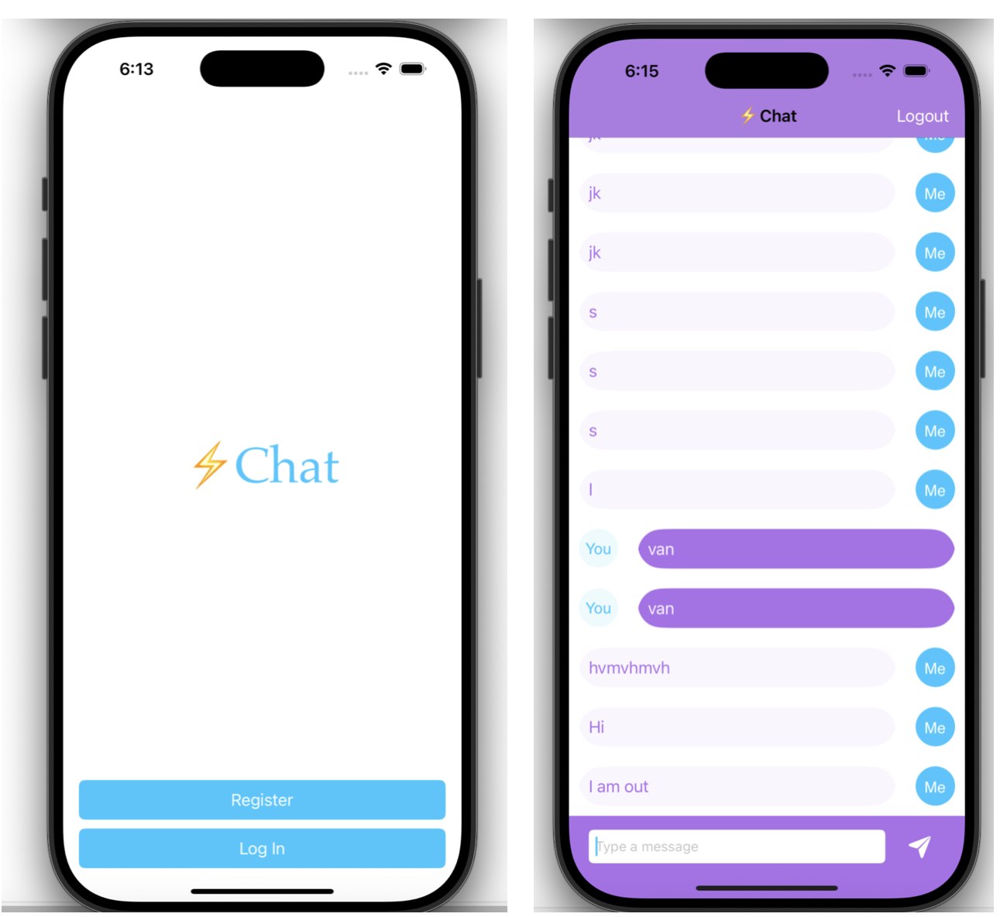

# 💬 iOS Chat App

An iOS chat application built using Swift and Firebase. This app allows users to register, log in, and exchange messages in real time.

## 📱 Features

- User Authentication with Firebase Auth
- Real-time Messaging using Firebase Firestore
- Custom Message Cells
- Keyboard handling using `IQKeyboardManagerSwift`
- Navigation with multiple view controllers

## 🛠️ Tech Stack

- **Language:** Swift
- **UI Framework:** UIKit
- **Backend:** Firebase (Auth, Firestore)
- **Keyboard Manager:** [IQKeyboardManagerSwift](https://github.com/hackiftekhar/IQKeyboardManager)

### Prerequisites

- Xcode 14+
- Swift Package Manager
- Firebase Project (with Firestore and Authentication enabled)

## Preview

  <!-- replace with your actual file name -->
